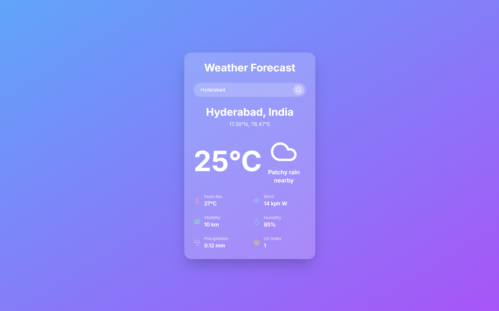

# Vatavarana

## Description

Vatavarana is a modern weather forecast application that provides real-time weather information for locations worldwide. Built with Next.js 14 App Router, TypeScript, and Tailwind CSS, it offers a sleek and responsive user interface. The app leverages the WeatherAPI.com API from RapidAPI to fetch accurate and up-to-date weather data.

## Features

- Search for weather information by city name
- Display current temperature and weather conditions
- Show additional details like "feels like" temperature, wind speed, and direction
- Provide information on visibility, humidity, precipitation, and UV index

## Technologies Used

- [Next.js 14 (App Router)](https://nextjs.org/)
- [TypeScript](https://www.typescriptlang.org/)
- [Tailwind CSS](https://tailwindcss.com/)
- [WeatherAPI.com](https://www.weatherapi.com/) (via [RapidAPI](https://rapidapi.com/))

## Usage

1. Enter a city name in the search bar.
2. Press Enter or click the search button.
3. View the current weather information for the specified location.

## API Reference

This app uses the [WeatherAPI.com API](https://rapidapi.com/weatherapi/api/weatherapi-com) from RapidAPI. You'll need to sign up for a RapidAPI account and subscribe to the WeatherAPI.com API to get your API key.
